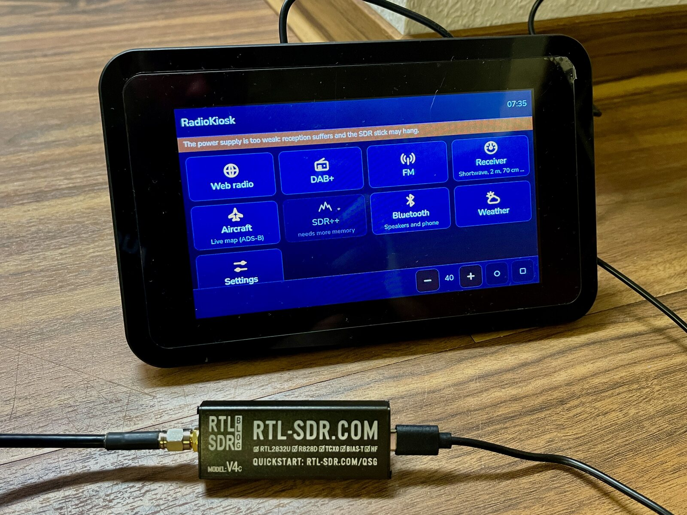
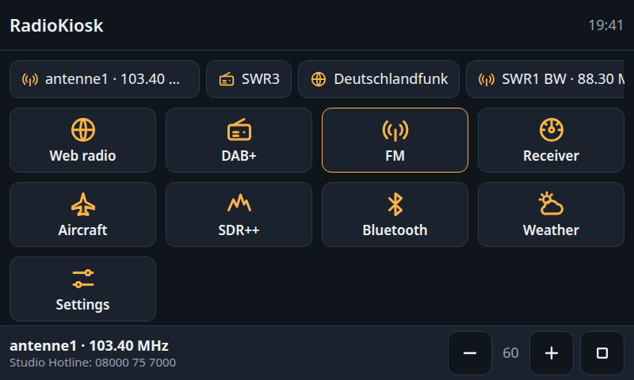
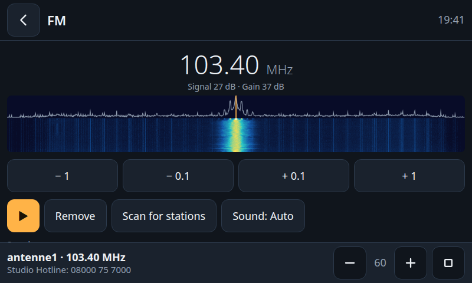
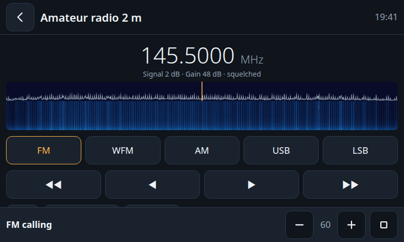
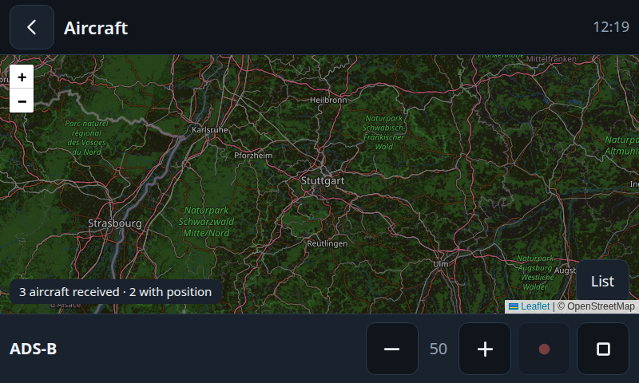
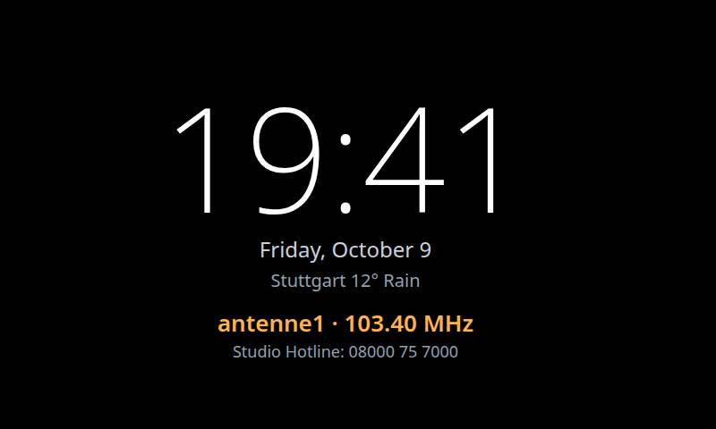

[English](README.md) · **Deutsch**

# RadioKiosk

Macht aus jedem Linux-Rechner mit Touchscreen und RTL-SDR-Stick einen Weltempfänger: Webradio, DAB+, UKW, Kurzwelle, Amateurfunk und mehr in einer Touch-Oberfläche.

[](https://github.com/TechnikWeber/RadioKiosk/actions/workflows/tests.yml)



| | |
|---|---|
|  |  |
|  |  |
|  | |

> Version 0.14: Alles hier Aufgeführte ist gebaut, aber noch nicht alles auf jeder Art von Hardware ausprobiert. Was getestet ist, steht in der Tabelle unter *Unterstützte Hardware*.

## Installation

```sh
curl -fsSL https://raw.githubusercontent.com/TechnikWeber/RadioKiosk/main/install.sh | bash
```

Der Installer läuft auf Fedora und auf Debian-basierten Systemen (Debian, Ubuntu, Raspberry Pi OS). Starte ihn als normaler Benutzer; er fragt nach deinem Passwort, um Pakete zu installieren. Danach erledigt er Folgendes:

1. Er installiert die Empfänger und Abspieler, die RadioKiosk steuert (`mpv`, `rtl-sdr`, `welle-cli`, SDR++, `dump1090` oder `readsb`, `rtl_433`, `rtl_ais`).
2. Er hindert den TV-Treiber des Kernels daran, den SDR-Stick zu belegen.
3. Er lädt RadioKiosk nach `~/.local/share/radiokiosk`.
4. Er startet es als Hintergrunddienst, der auch nach jeder Anmeldung wieder läuft.

Anschließend öffnest du **RadioKiosk** im Anwendungsmenü oder rufst <http://localhost:8080> auf. Zum Aktualisieren führst du dieselbe Zeile noch einmal aus.

Mit `--kiosk` öffnet sich die Oberfläche nach jeder Anmeldung im Vollbild, `--rotate=180` dreht den Bildschirm (Raspberry Pi OS), und mit `--with-sdrangel` kommt SDRangel als zweiter Experten-Empfänger dazu:

```sh
curl -fsSL https://raw.githubusercontent.com/TechnikWeber/RadioKiosk/main/install.sh | bash -s -- --kiosk --with-sdrangel
```

Programme, die deine Distribution nicht als Paket anbietet, werden übersprungen; ihre Kacheln bleiben deaktiviert oder unsichtbar, alles andere funktioniert.

## Raspberry Pi

Spiele **Raspberry Pi OS (64-bit) mit Desktop** auf, starte den Pi, verbinde ihn mit deinem Netz und führe den Installer mit `--kiosk` aus:

```sh
curl -fsSL https://raw.githubusercontent.com/TechnikWeber/RadioKiosk/main/install.sh | bash -s -- --kiosk
```

Nach dem nächsten Start öffnet der Pi RadioKiosk von selbst im Vollbild. Wissenswert:

- **Bild steht auf dem Kopf oder auf der Seite:** Hänge `--rotate=180` an (oder `90`, `270`). Das dreht den Desktop und nach dem nächsten Neustart auch den Startbildschirm. Das offizielle 7-Zoll-Touch-Display steht zum Beispiel in vielen Gehäusen und Ständern auf dem Kopf. Die Touch-Eingabe dreht sich mit. Auf anderen Systemen nimmst du die Anzeige-Einstellungen deines Desktops.
- **Strom:** Ein Pi mit Display und SDR-Stick braucht ein kräftiges Netzteil. Zeigt `vcgencmd get_throttled` etwas anderes als `0x0`, ist das Netzteil oder sein Kabel zu schwach; Sticks hängen sich dann auf und der Empfang leidet.
- **Pi 3:** Die Oberfläche ist etwa zwei Minuten nach dem Einschalten da. Getestet sind dort Webradio, UKW mit Sendernamen und die Flugzeugkarte. Der Wasserfall ist für seinen Prozessor zu viel; lass ihn dort ausgeschaltet. SDR++ braucht neben dem Browser mehr als dessen 1 GB Arbeitsspeicher, deshalb ist diese Kachel dort deaktiviert.
- **Flugzeuge:** Raspberry Pi OS hat `readsb` statt `dump1090`; darum kümmert sich der Installer.

## Unterstützte Hardware

| Teil | Unterstützt | Getestet |
|---|---|---|
| Rechner | 64-bit-Linux auf x86 oder ARM mit Fedora, Debian, Ubuntu oder Raspberry Pi OS | Fedora 44 auf einem x86-Laptop |
| Raspberry Pi | Pi 3, 4 und 5 mit Raspberry Pi OS 64-bit | Pi 3 B+ mit dem offiziellen 7-Zoll-Display: Installer, Kiosk-Start, Webradio, UKW, Flugzeugkarte |
| SDR-Stick | RTL-SDR Blog V4 und V3, andere RTL2832U-Sticks | RTL-SDR Blog V4 |
| Display | beliebig; die Oberfläche ist für Touch ab 800×480 gebaut | 800×480-Layout im Browser |
| Ton | jede Ausgabe, die PipeWire oder PulseAudio anbietet: Klinke, USB, Bluetooth, HDMI | eingebauter Ton |

Kurzwelle braucht einen Stick, der unter 24 MHz abstimmen kann: Der V4 macht das mit seinem eingebauten Umsetzer, der V3 über Direct Sampling. In beiden Fällen ist eine lange Drahtantenne nötig. Ohne Stick funktioniert weiterhin das Webradio.

## Was es kann

Ein kleiner Python-Dienst steuert die Empfänger und liefert eine Weboberfläche aus, die ein Browser im Vollbild zeigt.

| Kachel | Funktionen | Technik dahinter |
|---|---|---|
| Webradio | Sendersuche, beliebte Sender, Senderlogos | radio-browser.info, `mpv` |
| DAB+ | Sendersuchlauf, Senderliste, Lauftext, Bilder, die die Sender mitschicken, Empfangsanzeige zum Ausrichten der Antenne | `welle-cli`, `mpv` |
| UKW | Stereo, Sendernamen und Radiotext (RDS), Sendersuchlauf, Speicherplätze, Spektrum und Wasserfall | eingebauter Empfänger oder `rtl_fm`, `rtl_power`, `mpv` |
| Empfänger | freies Abstimmen in FM, AM und Seitenband mit Wasserfall, Rauschsperre, Kanal-Suchlauf und Bandplan: Kurzwelle, Amateurfunk, PMR446, Freenet, CB; auf Kurzwelle zeigt er, wer gerade sendet | eingebauter Empfänger, `mpv`, EiBi-Fahrplan |
| Flugzeuge | Live-Karte und Liste der Flugzeuge in deiner Umgebung (ADS-B) | `dump1090` oder `readsb`, Leaflet, OpenStreetMap |
| Bluetooth | Bluetooth-Lautsprecher verbinden oder ein Handy über dieses Gerät abspielen lassen | `bluetoothctl`, PipeWire |
| Wetter | aktuelles Wetter und Vorhersage für vier Tage | Open-Meteo |
| Podcasts | Suche, Abos, Folgenliste, Vor- und Zurückspringen; merkt sich, wie weit eine Folge gehört ist | fyyd, Apple Podcasts oder Podcast Index, `mpv` |
| Nachrichten | RSS- und Atom-Feeds als Liste der neuesten Artikel, aktualisiert sich selbst | eigener Feed-Leser |
| Funksensoren | Funk-Thermometer, Wetterstationen und andere Sensoren der Umgebung auf 433 MHz | `rtl_433` |
| Schiffe | Live-Karte und Liste der Schiffe in der Umgebung (AIS) | `rtl_ais`, Leaflet, OpenStreetMap |
| Funkwetter | Sonnenfluss, Sonnenflecken, K- und A-Index, Bandbedingungen für Kurzwelle und die MUF der nächsten Ionosonde | hamqsl.com (N0NBH), prop.kc2g.com (KC2G, GIRO) |
| QSO-Log | Logbuch für Funkverbindungen und für reine Hörer (SWL), mit Bändern und Betriebsarten zum Antippen; Export als ADIF und CSV nach `Dokumente/RadioKiosk` | – |
| Funk-Analyse | durchläuft einen Bereich über eine gewählte Zeit und berichtet, was zeitweise sendet, was dauernd da ist und was nach Störung aussieht; Bericht zum Speichern | `rtl_power`, NumPy |
| Timer | Kurzzeitwecker, der auch über dem laufenden Sender klingelt, und Stoppuhr | `mpv` |
| Galerie | Diashow aus einem Ordner, pur über die Kachel oder im Ruhebildschirm hinter der Uhr; mit oder ohne Unterordner, Bilder ganz, leicht gezoomt oder bildschirmfüllend | Pillow |
| SDR++ | das vollwertige SDR-Programm für alles Weitere | startet als normales Programm |
| Einstellungen | Sprache, helles oder dunkles Design, Tonausgabe, Sleep-Timer, Wecker, Ruhebildschirm, Größe der unteren Leiste, Bildschirmtastatur, Standort, Fernbedienung, Empfangsart | PipeWire oder PulseAudio |
| Gerät | Bildschirmhelligkeit, WLAN, WLAN-Stromsparen ein/aus, Aktualisieren, Neustart und Ausschalten, AirPlay- und Spotify-Connect-Empfänger | NetworkManager, systemd, `shairport-sync`, `librespot` |

Der Ruhebildschirm hat drei Arten, wählbar in den Einstellungen: die Uhr auf schwarzem Grund mit abgedunkeltem Display (Standard), die Galerie hinter der Uhr oder der neueste Artikel aus den Nachrichten. Bei den letzten beiden bleibt das Display hell.

Mondphase und Funkwetter lassen sich in den Einstellungen zuschalten; sie erscheinen dann im Ruhebildschirm und in der Wetter-Kachel. Beides ist standardmäßig aus.

Die Funk-Analyse misst grob: Über den ganzen Bereich von 24 bis 1766 MHz dauert ein Durchlauf auf einem Raspberry Pi 3 etwa 25 Sekunden, und der Stick ist nicht überall gleich empfindlich. Ob auf einem Band gerade jemand funkt, zeigt sie am zuverlässigsten, wenn du nur dieses Band wählst (2 m: etwa ein Durchlauf pro Sekunde). Träger, die der Stick selbst erzeugt, tauchen als Dauersignale auf.

Für die Podcast-Suche stehen drei Verzeichnisse zur Wahl (Einstellungen › Podcast-Verzeichnis). fyyd ist voreingestellt und braucht wie Apple Podcasts keinen Schlüssel; für den Podcast Index trägst du dort Schlüssel und Geheimnis ein, die es kostenlos auf podcastindex.org gibt.

Bis du einen eigenen Ordner wählst, zeigt die Galerie mitgelieferte Demobilder (gemeinfrei, siehe [demo-pictures/CREDITS.md](demo-pictures/CREDITS.md)). Die Galerie zeigt jeden Ordner, den dieser Rechner lesen kann. Soll es ein USB-Stick oder ein Netzwerkordner (SMB, NFS) sein, musst du ihn selbst einbinden, zum Beispiel über den Dateimanager oder die `/etc/fstab`; danach lässt er sich in den Einstellungen unter *Galerie* wählen. Fotos werden einmal auf Bildschirmgröße verkleinert und zwischengespeichert.

Jeder Sender kann einen Stern bekommen, egal aus welcher Quelle. Favoriten erscheinen als Zeile auf dem Startbildschirm und starten mit einem Tipp; einzelne oder alle entfernst du über den Stern am Ende dieser Zeile, etwa nach einem Ortswechsel.

Die Oberfläche ist standardmäßig englisch und lässt sich in den Einstellungen auf Deutsch umstellen.

Ist in den Einstellungen die Fernbedienung eingeschaltet, können Handys und Rechner im selben Netz die Oberfläche im Browser öffnen. Es gibt keine Anmeldung, nutze das also nur in einem Netz, dem du vertraust.

Der Aufnahmeknopf in der unteren Leiste speichert, was gerade läuft, nach `Musik/RadioKiosk`. Bei eingeschalteter Fernbedienung können andere Geräte im Netz außerdem unter `http://<Adresse>:8080/live.mp3` mithören.

RadioKiosk warnt, wenn ein Raspberry Pi zu wenig Spannung meldet, und startet einen SDR-Stick, der sich am USB aufgehängt hat, selbst neu, statt dich zum Umstecken aufzufordern.

Den Stick kann immer nur ein Empfänger nutzen, deshalb beendet der Dienst den laufenden, bevor er den nächsten startet. Kacheln, deren Programm oder Hardware fehlt, sind deaktiviert.

UKW und der freie Empfänger nutzen den eigenen Empfänger von RadioKiosk, geschrieben in Python mit NumPy: Er demoduliert, dekodiert RDS, zeichnet einen Wasserfall und stimmt um, ohne den Stick neu zu starten. Der Wasserfall ist standardmäßig aus und lässt sich in der UKW- und in der Empfänger-Ansicht getrennt einschalten. Ohne ihn nimmt der Empfänger nur den Sender selbst auf und braucht etwa ein Drittel der Rechenleistung; mit ihm beobachtet er 1,5 MHz auf einmal. In den Einstellungen lässt sich jede der beiden Kacheln stattdessen auf das klassische Programm `rtl_fm` umstellen (Mono, kein Wasserfall, schont den Prozessor) und vergleichen.

Die Tuner-Verstärkung regelt sich beim Hören selbst nach, weil die Automatik des Sticks an einer guten Antenne übersteuert. Die Werte werden je Band gemerkt; nach einem Antennenwechsel setzt du sie in den Einstellungen zurück.

Der Wecker weckt mit einem festen Sender oder mit dem zuletzt gehörten; startet der nicht, ertönt ersatzweise ein Ton. Der Rechner muss dafür laufen.

Nach einer Weile ohne Berührung zeigt ein Ruhebildschirm Uhrzeit, Datum, Wetter und den laufenden Sender. Für die Sendersuche bringt die Oberfläche eine eigene Bildschirmtastatur mit, weil Systemtastaturen je nach Desktop verschieden sind; sie erscheint auf Touchscreens und lässt sich in den Einstellungen abschalten.

Das Abhören von Funkdiensten, die nicht für die Allgemeinheit bestimmt sind, ist in vielen Ländern eingeschränkt. Der Bandplan enthält deshalb nur Rundfunk, Amateurfunk und anmeldefreie Bänder.

## Aus dem Quelltext starten

```sh
git clone https://github.com/TechnikWeber/RadioKiosk.git
cd RadioKiosk
python3 -m venv .venv
.venv/bin/pip install -r requirements.txt
.venv/bin/python -m radiokiosk
```

Dafür braucht es dieselben Programme, die der Installer einrichtet, und der DVB-Treiber des Kernels darf den Stick nicht belegen:

```sh
echo 'blacklist dvb_usb_rtl28xxu' | sudo tee /etc/modprobe.d/blacklist-rtlsdr.conf
```

## Tests

```sh
.venv/bin/python -m unittest
```

Die Tests schicken künstliche Funksignale durch die Demodulatoren und den RDS-Dekoder; einen SDR-Stick brauchen sie nicht.

## Einstellungen

Optionale Datei `~/.config/radiokiosk/config.json`:

| Schlüssel | Standard | Bedeutung |
|---|---|---|
| `remote` | `false` | erlaubt Handys und PCs im lokalen Netz, RadioKiosk zu bedienen (ohne Anmeldung); auch als Schalter in den Einstellungen |
| `host` | `0.0.0.0` | auf `127.0.0.1` setzen, um nie im Netz zu lauschen |
| `port` | `8080` | Port der Weboberfläche |
| `country` | `DE` | Ländercode für die Liste beliebter Webradio-Sender |
| `location` | nicht gesetzt | `[Breite, Länge]` für Flugzeug-Karte und Wetter; einfacher in den Einstellungen festzulegen |
| `fm_backend`, `tuner_backend` | `auto` | Empfänger für die Kacheln UKW und Empfänger: `engine` (eingebaut), `rtl_fm` oder `auto`, das den eingebauten nimmt, wo der Prozessor schnell genug ist; auch in den Einstellungen |
| `fm_stereo` | `auto` | UKW-Ton: `auto` (Stereo nur bei starkem Signal), `stereo` oder `mono`; auch als Knopf in der UKW-Ansicht |
| `gain` | `auto` | Tuner-Verstärkung: `auto` regelt sie beim Hören nach, eine Zahl in dB erzwingt sie |
| `apps` | SDR++, SDRangel | externe Programme, die als Kachel erscheinen |

## Lizenz

[MIT](LICENSE). Die Kurzwellen-Sendepläne stammen von [EiBi](http://www.eibispace.de/) von Eike Bierwirth, der sie kostenlos anbietet. Die mitgelieferte Kartenbibliothek Leaflet steht unter der BSD-2-Clause-Lizenz, siehe `web/vendor/leaflet/LICENSE`.
