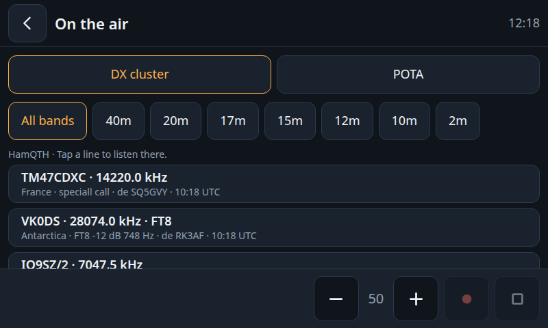
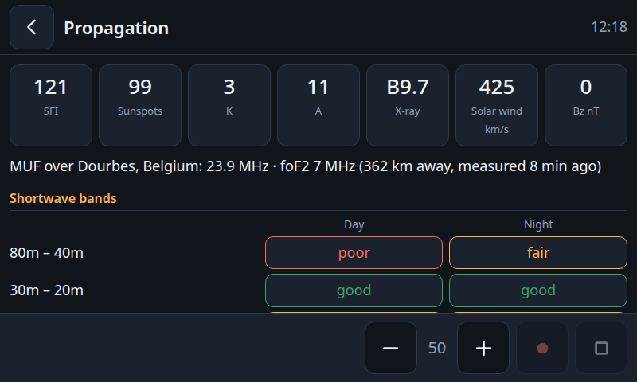
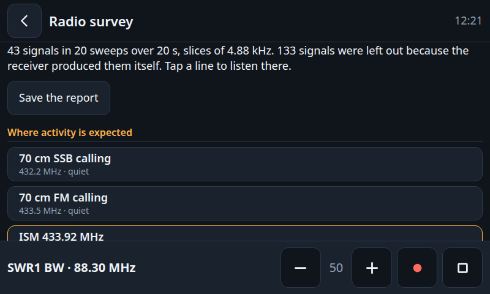

**English** · [Deutsch](README.de.md)

# RadioKiosk

Turns any Linux computer with a touchscreen and an RTL-SDR stick into a world receiver: web radio, DAB+, FM, shortwave, amateur radio and more in one touch interface.

[](https://github.com/TechnikWeber/RadioKiosk/actions/workflows/tests.yml)


| | |
|---|---|
|  |  |
|  |  |
|  |  |
|  |  |

> Version 0.16: everything listed here is built, but not all of it has been tried on every kind of hardware yet. See the table under *Supported hardware* for what has been tested.

## Install

```sh
curl -fsSL https://raw.githubusercontent.com/TechnikWeber/RadioKiosk/main/install.sh | bash
```

The installer works on Fedora and on Debian-based systems (Debian, Ubuntu, Raspberry Pi OS). Run it as your normal user; it asks for your password to install packages. It then:

1. installs the receivers and players RadioKiosk controls (`mpv`, `rtl-sdr`, `welle-cli`, SDR++, `dump1090` or `readsb`, `rtl_433`, `rtl_ais`),
2. stops the kernel's TV driver from claiming the SDR stick,
3. downloads RadioKiosk to `~/.local/share/radiokiosk`,
4. starts it as a background service that also comes up after every login.

Afterwards open **RadioKiosk** from the application menu or go to <http://localhost:8080>. Run the same line again to update.

Add `--kiosk` to open the interface full screen after every login, `--rotate=180` to turn the screen (Raspberry Pi OS), and `--with-sdrangel` for SDRangel as a second expert receiver:

```sh
curl -fsSL https://raw.githubusercontent.com/TechnikWeber/RadioKiosk/main/install.sh | bash -s -- --kiosk --with-sdrangel
```

Programs your distribution does not package are skipped; their tiles stay disabled or hidden and everything else works.

## Raspberry Pi

Flash **Raspberry Pi OS (64-bit) with desktop**, boot it, connect it to your network and run the installer with `--kiosk`:

```sh
curl -fsSL https://raw.githubusercontent.com/TechnikWeber/RadioKiosk/main/install.sh | bash -s -- --kiosk
```

After the next start the Pi opens RadioKiosk full screen by itself. Things worth knowing:

- **Screen upside down or on its side:** add `--rotate=180` (or `90`, `270`). This turns the desktop and, after the next restart, the boot screen. The official 7 inch touch display, for example, ends up upside down in many cases and stands. The touch input turns with it. On other systems, use the display settings of your desktop.
- **Power:** a Pi with display and SDR stick needs a strong supply. If `vcgencmd get_throttled` shows anything but `0x0`, the supply or its cable is too weak; sticks then hang and reception suffers.
- **Pi 3:** the interface is there about two minutes after power-on. Web radio, FM with station names and the aircraft map have been tested on it. The waterfall is too much for its processor; leave it switched off there. SDR++ needs more than its 1 GB of memory next to the browser, so that tile is disabled there.
- **Aircraft:** Raspberry Pi OS has `readsb` instead of `dump1090`; the installer takes care of it.

## Supported hardware

| Part | Supported | Tested |
|---|---|---|
| Computer | 64-bit Linux on x86 or ARM with Fedora, Debian, Ubuntu or Raspberry Pi OS | Fedora 44 on an x86 laptop |
| Raspberry Pi | Pi 3, 4 and 5 with Raspberry Pi OS 64-bit | Pi 3 B+ with the official 7 inch display: installer, kiosk start, web radio, FM, aircraft map |
| SDR stick | any stick the `librtlsdr` library knows: RTL-SDR Blog V4 and V3, Nooelec NESDR and other RTL2832U sticks, also older DVB-T sticks with an E4000, FC0012/13 or FC2580 tuner. Shortwave only with a V4 (built-in upconverter) or sticks with direct sampling such as the V3. Other SDR families (Airspy, HackRF, SDRplay) are not supported. | RTL-SDR Blog V4 |
| Display | any; the interface is built for touch from 800×480 upwards and goes one size up on large screens (1500 pixels wide or more) | 800×480 on the official 7 inch display; 480×320 to 1920×1080 in a browser |
| Audio | every output PipeWire or PulseAudio offers: headphone jack, USB, Bluetooth, HDMI | built-in audio |

Shortwave needs a stick that can tune below 24 MHz: the V4 does it with its built-in upconverter, the V3 through direct sampling. Either way it needs a long wire antenna. Without a stick, web radio still works.

## What it does

A small Python service controls the receivers and serves a web interface that a browser shows full screen.

| Tile | What you get | Backend |
|---|---|---|
| Web radio | station search, popular stations, station logos | radio-browser.info, `mpv` |
| DAB+ | station scan, station list, scrolling text, pictures the stations send, reception meter for aligning the antenna | `welle-cli`, `mpv` |
| FM | stereo, station names and radio text (RDS), band scan, presets, spectrum and waterfall | built-in receiver or `rtl_fm`, `rtl_power`, `mpv` |
| Receiver | free tuning in FM, AM and sideband with waterfall, squelch, channel scan and a band plan: shortwave, amateur radio, PMR446, Freenet, CB; on shortwave it lists who is on the air right now | built-in receiver, `mpv`, EiBi schedule |
| Aircraft | live map and list of the aircraft around you (ADS-B) | `dump1090` or `readsb`, Leaflet, OpenStreetMap |
| Bluetooth | connect a Bluetooth speaker, or let a phone play through this device | `bluetoothctl`, PipeWire |
| Weather | current weather and a four-day forecast | Open-Meteo |
| Podcasts | search, subscriptions, episode list, skipping back and forth; remembers how far an episode has been heard | fyyd, Apple Podcasts or Podcast Index, `mpv` |
| News | RSS and Atom feeds as a list of the newest articles that refreshes itself | own feed reader |
| Sensors | wireless thermometers, weather stations and other sensors nearby on 433 MHz | `rtl_433` |
| Ships | live map and list of the ships nearby (AIS) | `rtl_ais`, Leaflet, OpenStreetMap |
| Propagation | solar flux, sunspots, K and A index, shortwave band conditions and the MUF of the nearest ionosonde | hamqsl.com (N0NBH), prop.kc2g.com (KC2G, GIRO) |
| On the air | who is transmitting right now: DX cluster and Parks on the Air, filtered by band; a tap tunes the receiver there | HamQTH (DX Summit to fall back on), pota.app |
| QSO log | logbook for contacts and for listeners (SWL), with bands and modes to tap; export as ADIF and CSV to `Documents/RadioKiosk` | – |
| Radio survey | sweeps a range for a chosen time and reports what transmits now and then, what is always there and what looks like interference; the report can be saved | `rtl_power`, NumPy |
| Timer | kitchen timer that also rings over the station that is playing, and a stopwatch | `mpv` |
| Gallery | slide show from a folder, on its own through the tile or behind the clock on the idle screen; with or without subfolders, pictures whole, slightly zoomed or filling the screen | Pillow |
| SDR++ | the full SDR program for everything else | started as a normal program |
| Settings | language, light or dark design, audio output, sleep timer, alarm clock, idle screen, size of the bottom bar, on-screen keyboard, location, remote control, receiver backend | PipeWire or PulseAudio |
| Device | screen brightness, Wi-Fi, Wi-Fi power saving on/off, update, restart and shut down, AirPlay and Spotify Connect receivers | NetworkManager, systemd, `shairport-sync`, `librespot` |

The idle screen comes in four kinds, chosen in the settings: the clock on black with the display dimmed (the default), the gallery behind the clock, the newest articles of the news reader, or the newest spots of the DX cluster. The last three keep the display bright.

Without an internet connection everything that needs none keeps working (FM, DAB+, receiver, gallery, timer, QSO log, radio survey); the other tiles say that their source cannot be reached.

Moon phase and propagation can be switched on in the settings; they then appear on the idle screen and in the weather tile. Both are off by default.

The radio survey measures coarsely: over the whole range from 24 to 1766 MHz one sweep takes about 25 seconds on a Raspberry Pi 3, and the stick is not equally sensitive everywhere. Whether somebody is on the air on a band shows most reliably when you choose only that band (2 m: about one sweep per second). Every second sweep is tuned differently; what only one of the two tunings shows is produced by the stick itself and left out. "Everything" reaches as far as the connected stick tunes, from 0.5 MHz with a Blog V4.

The podcast search can use three directories (Settings › Podcast directory). fyyd is the default and, like Apple Podcasts, needs no key; for the Podcast Index, enter the key and secret you get for free at podcastindex.org.

Until you choose a folder of your own, the gallery shows the demo pictures that come with RadioKiosk (public domain, see [demo-pictures/CREDITS.md](demo-pictures/CREDITS.md)). The gallery shows any folder this computer can read. For a USB stick or a network folder (SMB, NFS), mount it yourself, for example with the file manager or in `/etc/fstab`; it can then be chosen in the settings under *Gallery*. Photos are scaled down to screen size once and cached.

Every station can get a star, whatever its source. Favorites appear as a row on the start screen and start with one tap; remove single ones or all of them under the star at the end of that row, for example after moving to another place.

The interface is English by default and can be switched to German under Settings.

With remote control switched on under Settings, phones and computers in the same network can open the interface in a browser. There is no login, so use it only in a network you trust.

The record button in the bottom bar saves what is playing to `Music/RadioKiosk`. With remote control on, other devices in the network can also listen along at `http://<address>:8080/live.mp3`.

RadioKiosk warns when a Raspberry Pi reports too little voltage, and it restarts an SDR stick that has hung on the USB bus instead of asking you to replug it.

Only one receiver can use the stick at a time, so the service stops the running one before starting the next. Tiles whose program or hardware is missing are disabled.

FM and the free receiver use RadioKiosk's own receiver, written in Python with NumPy: it demodulates, decodes RDS, draws a waterfall and retunes without restarting the stick. The waterfall is off by default and can be switched on separately in the FM and the Receiver view. Without it the receiver only takes in the station itself, which needs about a third of the processing; with it, it watches 1.5 MHz at once. Under Settings you can switch each of the two to the classic `rtl_fm` program instead (mono, no waterfall, lighter on the processor) and compare.

The tuner gain adjusts itself while listening, because the stick's own automatic gain overdrives on a good antenna. The values are remembered per band; reset them under Settings after changing the antenna.

The alarm clock wakes with a fixed station or with the one heard last; if that does not start, it falls back to a tone. The computer has to be running for it.

After a while without a touch, an idle screen shows the time, date, weather and what is playing. The interface brings its own on-screen keyboard for the station search, because system keyboards differ from desktop to desktop; it appears on touch screens and can be switched off under Settings.

Listening to radio services that are not meant for the public is restricted in many countries. The band plan therefore only contains broadcast, amateur radio and licence-free bands.

## Run from source

```sh
git clone https://github.com/TechnikWeber/RadioKiosk.git
cd RadioKiosk
python3 -m venv .venv
.venv/bin/pip install -r requirements.txt
.venv/bin/python -m radiokiosk
```

This needs the same programs the installer sets up, and the kernel's DVB driver must not claim the stick:

```sh
echo 'blacklist dvb_usb_rtl28xxu' | sudo tee /etc/modprobe.d/blacklist-rtlsdr.conf
```

## Tests

```sh
.venv/bin/python -m unittest
```

The tests feed synthetic radio signals through the demodulators and the RDS decoder; they need no SDR stick.

## Settings

Optional file `~/.config/radiokiosk/config.json`:

| Key | Default | Meaning |
|---|---|---|
| `remote` | `false` | let phones and PCs in the local network control RadioKiosk (no login); also a switch under Settings |
| `host` | `0.0.0.0` | set to `127.0.0.1` to never listen on the network at all |
| `port` | `8080` | port of the web interface |
| `country` | `DE` | country code for the list of popular web radio stations |
| `location` | not set | `[latitude, longitude]` for the aircraft map and the weather; easier to set under Settings |
| `fm_backend`, `tuner_backend` | `auto` | receiver for the FM and Receiver tiles: `engine` (built-in), `rtl_fm`, or `auto`, which takes the built-in one where the processor is fast enough; also under Settings |
| `fm_stereo` | `auto` | FM sound: `auto` (stereo only on a strong signal), `stereo` or `mono`; also a button in the FM view |
| `gain` | `auto` | tuner gain: `auto` adjusts it while listening, a number in dB forces it |
| `apps` | SDR++, SDRangel | external programs shown as tiles |

## License

[MIT](LICENSE). Shortwave schedules come from [EiBi](http://www.eibispace.de/) by Eike Bierwirth, who offers them free of charge. The bundled map library Leaflet is BSD-2-Clause licensed, see `web/vendor/leaflet/LICENSE`.
